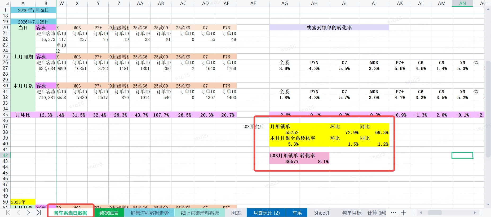

# vp-daily-report

从 VP 日报 Excel 中读取数据，生成两段可直接使用的文案：

- `概览解析-AI颜色版`
- `车系数据解析-AI颜色版`

正式脚本为 `VP日报自动化/scripts/calc_vp_daily_report.py`，仅使用 Python 标准库，无需安装额外依赖。原 R 脚本保留作历史参考，不再维护最新口径。

## 使用方法

```powershell
python "VP日报自动化\scripts\calc_vp_daily_report.py" `
  "C:\path\to\VP日报_20260915.xlsx"
```

默认会从文件名中的日期推断运行日期，并计算前一天。例如 `VP日报_20260915.xlsx` 对应目标日期 `2026-09-14`。

也可以明确传入运行日期和输出文件：

```powershell
python "VP日报自动化\scripts\calc_vp_daily_report.py" `
  "C:\path\to\source.xlsx" `
  2026-09-15 `
  "outputs\vp_daily_fields_20260915.csv"
```

需要绕过文件名推断时，可以直接指定目标日期：

```powershell
python "VP日报自动化\scripts\calc_vp_daily_report.py" `
  "C:\path\to\source.xlsx" `
  --target-date 2026-09-14
```

默认输出为 `outputs/vp_daily_fields.csv`。CSV 使用 UTF-8 with BOM 编码，可直接用 Excel 打开。

## 对比口径

| 目标日期 | `compare_rule` | 文案口径 | 当前值 | 比较值 |
| --- | --- | --- | --- | --- |
| 周一 | `prev_week_weekday_avg` | 上一周周中日均 | 当日 | 上周一至周五日均 |
| 周二至周五 | `previous_day` | 前一日 | 当日 | 前一日 |
| 周六 | `prev_weekend_avg` | 上周末日均 | 当日 | 上周六、周日日均 |
| 周日 | `weekly_vs_last_week` | 上周 | 本周一至周日合计 | 上周一至周日合计 |

变化率统一按 `current / baseline - 1` 计算。周一和周六的比较值取日均，周日按完整自然周合计。

脚本会校验官渠客流和主要趋势指标是否覆盖完整比较周期。缺少日期时直接报错，避免把未更新数据当成最新结果。

## 概览口径

数据主要来自 `销售过程数据走势` 和 `线上官渠潜客客流`。

### 线索

输出顺序为：

1. 全系线索总量及变化率
2. G9L 线索量、占全系比例及变化率
3. 全系非 G9L 线索变化率
4. GX、L03、其他车型变化率

不再输出线上线索、线下线索。衍生口径为：

```text
非 G9L = 全系 - G9L
其他车型 = 全系 - G9L - GX - L03
```

### 试驾

输出全系试驾总量及变化率；G9L 输出试驾量、占比和变化率；L03、GX、其他车型只输出变化率。

G9L 试驾的历史周期如果只有部分日期有值，脚本按有值日期计算日均，并在文案中明确写为“有值日均”。完全没有历史值时输出“暂无可比数据”。计算其他车型时，缺失的 G9L 试驾按 0 处理。

### 锁单

全系、L03、GX 锁单直接读取 `销售过程数据走势` 的 `锁单` 行。其他车型口径为：

```text
其他车型 = 全系 - G9L - GX - L03
```

当前底表没有 G9L 锁单值时按 0 处理。

所有衍生指标都先按日期计算，再按比较规则求日均或合计。这样不会因各车系有效天数不同而产生错误环比。

## 车系数据口径

`各车系当日数据` 的固定单元格：

| 指标 | 当日 | 月累 | 月累环比 | 月累同比 |
| --- | --- | --- | --- | --- |
| 客流 | B4 | B16 | B20 | B65 |
| 线索 | D4 | D16 | D20 | D65 |
| 试驾 | M4 | M16 | M20 | M65 |

当日锁单直接读取 `销售过程数据走势` 的全系锁单。锁单和转化率的月累数据来自 `月累环比 (2)`：

| 指标 | 月累 | 月累环比 | 月累同比 |
| --- | --- | --- | --- |
| 锁单 | T3 | U3 | V3 |
| 转化率 | W3 | X3 | Y3 |

> [!NOTE]
> 月累锁单和转化率是二次加工数据，底层来自 `各车系当日数据!AG37:AJ43` 的计算区域。



如果 `各车系当日数据!M4` 与趋势表的全系试驾日值不同，脚本会输出口径差异提示；概览使用趋势表，车系数据解析使用 `M4`。

## Excel 要求

输入文件必须包含：

- `销售过程数据走势`
- `线上官渠潜客客流`
- `各车系当日数据`
- `月累环比 (2)`

趋势表按第一列动态定位 `全系`、`G9L`、`GX`、`L03` 区块。每个区块下一行是日期，后续行按指标名称定位 `客流`、`线索`、`试驾`、`锁单`，因此日期列可以随日报向右扩展。

## 输出字段

| 字段 | 含义 |
| --- | --- |
| `field` | 文案字段名 |
| `target_date` | 实际计算日期 |
| `compare_rule` | 使用的对比规则 |
| `compare_label` | 文案中的比较口径 |
| `content` | 完整文案 |
